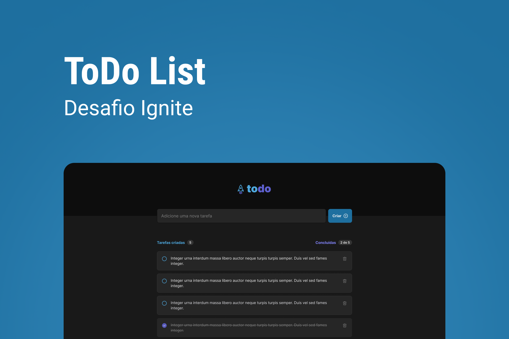

# Praticando os conceitos do ReactJS ⚛️
## Desafio 01 do Ignite 🚀💙

 

 

# Sobre o desafio

Desenvolver uma aplicação de controle de tarefas no estilo to-do list, que 
contém as seguintes funcionalidades:  👨‍🔧

✅ - Adicionar uma nova tarefa  
✅ - Marcar e desmarcar uma tarefa como concluída  
✅ - Remover uma tarefa da listagem  
✅ - Mostrar o progresso de conclusão das tarefas  

Funcionalidades extras que estou trabalhando para adicionar: 🔥  

✅ - Salvar tarefas em Local Storage  
✅ - Resetar diariamente as tarefas se o usuário desejar  
✅ - Tamanho responsivo  
🟩 - Tema Dark e Light  

 

# Tecnologias usadas 🛠️

- HTML 
- CSS 
- Vite 
- ReactJS ⚛️
- TypeScript  

 

# Para ver funcionando
<a href="https://Felipe-Rasnheski.github.io/ToDoList">Clique aqui 💜</a>